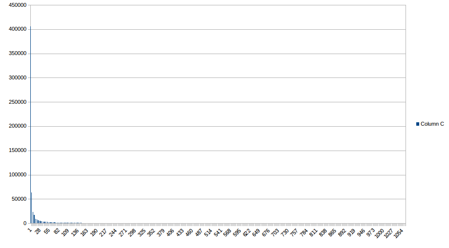

Detection of relations between actors on the Common Crawl data set
============

Abstract
--------------------------
In this document we outline the project that was done for the Data Science course and our experiences.

Introduction
--------------------------
In this project we built a graph of co-occurences of actors on the web. To do so, we used Hadoop. The resulting graph was then use in a proof-of-concept recommander application built in Spark. The data used for this project was the Common Crawl dataset. This dataset is provided in several different formats. The choice was made to use the WAT format. That was because there was no need for the structural information about the webpages (rather not for speed).  
The list with actors is retrieved from IMBD. They provided a list with all actors in their database, this list was transformed to a easier usable format. 

Co-occurence counting
--------------------------
As said before, the Co-occurence counting is done in Hadoop. Two Hadoop jobs were used to count the co-occurences. These two jobs can be started using a single program.
 
### Hadoop job 1
The goal of this job is to count the co-occurences of actors from the list. 
This is done in the MAP phase by looping through all lines of a WAT file and registering the presents of the name of actors per page. Pages are dilimeted by the WARC header. Using all the list of actors per page, all occurences of an actor from the list is emitted, along with the URL of the page.
In the reduce phase, the bigrams are made from the actors that were found in the web page. These bigrams are then writen to disk as result.

### Hadoop job 2
This job is a simple counting program.
The map-phase actually does not do anything. It just deserializes the data and then emmits the bigram object. 
In the reducer, the number of occurences of a bigram is counted and written to disk as a result.

Clustering
--------------------------
The goal of the clustering phase is to find groups of related actors.
The input comes from the hadoop jobs which are bigrams which represents two actors together with the number of occurences they were mentioned on the same page.
From all the avaiable clustering algorithms, the k-means was chosen due to the simplicity and speed.
The rule of thumb was used in order to determine the appropiate number for k. 
The formulate is  sqrt(n/2), where n is the amount of bigrams.
The output of the clustering phase are groups of actors.

Recommending
--------------------------
The recommender application suggest similar actors based on a given actors.
It uses the groups of actors from the clustering phase.
For a particular actor it finds the related actors in a cluster and outputs them as an recommendation.

Results
-------------------------
Having build an infrastructure to do this kind of analysis, it would be a shame not to use it. Therefore, the algorithms were put into test on a section (about 10%) of the Common Crawl dataset. And even though there was a list of about 100.000 actors composed from IMDB, a subset of 50 of the most popular actors (according to IMDB) was used. This was done for the interprability of the results. 
After running the Map-Reduce jobs, a list with all the co-occurences of the actors was formed. What is interesting to notice here is that the absolute number one is the pair consisting of Kate Upton and Kate Mara. The hypothesis is that this is caused by what makes the Internet go round. 
When the distribution of the occurences is examined more closely, it turns out that it is a long-tail distribution. Very few are mentioned a lot, and most of the actors are rarely mentioned together. This can be seen as a problem because the very frequent results can overshadow the other results later on.	

Discussion
--------------------------
The goal of the project was to get hands-on experience with hadoop.
In our opinion this is accomplished.
Programming the hadoop jobs with the MapReduce paradigm and clustering algorithm with Spark went well. 
Where we struggled with was the connection to the hadoop clusters and accessing the appropiate Common Crawl dataset.
In the end we managed to connect with the clusters properly and processed about 10% of all the WAT files.
This was mainly due to time constraints.
Finally, although the recommander has been discussed, the concept hasn't been developed due to the scope of the project.

